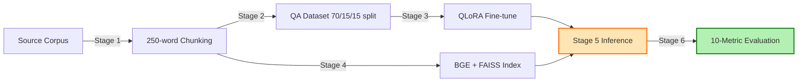

<div align="center">

# 🏥 PAG-Health-LLM

### A Domain-Specific Retrieval-Augmented Large Language Model for Pediatric and Adolescent Gynecology Clinical Decision Support

[](https://www.python.org/)
[](https://pytorch.org/)
[](https://huggingface.co/transformers)
[](LICENSE)

[](https://huggingface.co/mistralai/Mistral-7B-Instruct-v0.3)
[](https://arxiv.org/abs/2305.14314)
[](https://arxiv.org/abs/2005.11401)
[](https://huggingface.co/BAAI/bge-small-en-v1.5)
[](https://github.com/facebookresearch/faiss)
[](#disclaimer)

[]()
[]()
[]()
[]()
[]()

<p>
  <a href="#-quick-start"><strong>Quick Start</strong></a> •
  <a href="#%EF%B8%8F-pipeline-overview"><strong>Pipeline</strong></a> •
  <a href="#-results"><strong>Results</strong></a> •
  <a href="#-citation"><strong>Citation</strong></a> •
  <a href="#%EF%B8%8F-disclaimer"><strong>Disclaimer</strong></a>
</p>

</div>

---

## 📖 About

**PAG-Health-LLM** is the first domain-specialized 7-billion-parameter retrieval-augmented large language model purpose-built for **Pediatric and Adolescent Gynecology (PAG)**, a clinical specialty too narrow to attract frontier-AI laboratories, yet too consequential to leave under-served.

> **Key finding:** A 7B-parameter specialized model can substantially outperform 70B-parameter frontier generalist models on a narrow clinical domain, demonstrating that **specialization plus citation-grounded retrieval, not scale alone, is a practical path to deployable clinical AI**.

<table>
<tr>
<td>

### ⚡ Core Capabilities
- 🎯 7B specialist beats 70B generalists
- 📚 Citation-grounded answers
- ⚡ 30-min training on consumer GPU
- 🛡️ "RAG-first, model-fallback" safety
- 📊 10-metric comprehensive evaluation
- 🔒 Apache 2.0 open license

</td>
<td>

### 🧪 Built With
- 🤗 **Mistral-7B-Instruct-v0.3** (Apache 2.0)
- 🔧 **QLoRA** parameter-efficient fine-tuning
- 🔍 **BGE-small-en-v1.5** dense embeddings
- ⚡ **FAISS** sub-second retrieval
- 📈 **ROUGE / BERTScore / METEOR / BLEURT / SAS / G-Eval**
- 🐍 **Python 3.10+** / **PyTorch 2.0+**

</td>
</tr>
</table>

---

## 🚀 Quick Start

### Installation

```bash
git clone https://github.com/VahidMonfared/llm_pag_health_medicine.git
cd llm_pag_health_medicine
pip install -r requirements.txt
```

### Prepare your corpus

> ⚠️ **The training corpus is NOT included** due to source-textbook copyright. You must provide your own plain-text corpus.

Place your text files in `data/source_text/` and a QA seed JSONL at `data/qa_seed.jsonl`:

```json
{"section_id": "section_001", "question": "What is ...?", "answer": "..."}
```

### Run the pipeline

```bash
python pag_health_llm_pipeline.py 1                                   # Chunk corpus
python pag_health_llm_pipeline.py 2 --qa_seed data/qa_seed.jsonl      # Split 70/15/15
python pag_health_llm_pipeline.py 3                                   # QLoRA fine-tune
python pag_health_llm_pipeline.py 4                                   # Build FAISS index
python pag_health_llm_pipeline.py 5 --query "How is PCOS diagnosed?"  # Ask a question
python pag_health_llm_pipeline.py 6                                   # Evaluate
```

### Launch the Gradio demo

```bash
export GROQ_API_KEY="your_key_here"
python app.py
# → http://localhost:7860
```

---

## 🏗️ Pipeline Overview



### Architecture details

| Stage | Component | Detail |
|:-:|---|---|
| 1️⃣ | Corpus ingestion | Plain-text → 250-word chunks, 50-word overlap |
| 2️⃣ | No-leakage split | 70 % train / 15 % val / 15 % test, **partitioned by section** |
| 3️⃣ | QLoRA fine-tuning | r=16, α=32, dropout=0.05, 4-bit NF4 quantization, ~30 min on T4 |
| 4️⃣ | Retrieval | BGE-small-en-v1.5 (384-d), FAISS IndexFlatIP, top-k=3 |
| 5️⃣ | Inference | Cascading RAG-first, model-fallback (similarity ≥ 0.50) |
| 6️⃣ | Evaluation | 10 metrics + paired t-tests + Cohen's d |

---

## 📊 Results

### Headline benchmark on 182 held-out questions

| System | Params | BERTScore | ROUGE-L | METEOR | chrF++ | BLEURT |
|---|:-:|:-:|:-:|:-:|:-:|:-:|
| **🥇 PAG-Health-LLM (Ours)** | **7 B** | **0.909** | **0.413** | **0.526** | **0.489** | **0.448** |
| GPT-4o-mini | ~8 B | 0.870 | 0.232 | 0.303 | 0.362 | 0.412 |
| LLaMA-3.3-70B | 70 B | 0.868 | 0.217 | 0.300 | 0.354 | 0.403 |
| Qwen-3-32B | 32 B | 0.854 | 0.184 | 0.246 | 0.297 | 0.358 |

> All 24 external pairwise comparisons reach *p* < 0.001 with Cohen's *d* = 0.46 – 1.70 (21 large, 3 medium).

### Internal ablation

> RAG alone explains ~95 % of the gain. Fine-tuning adds the final stylistic polish.

| Configuration | RAG | Fine-tune | BERTScore |
|---|:-:|:-:|:-:|
| Base only | ❌ | ❌ | 0.870 |
| Base + RAG | ✅ | ❌ | 0.907 |
| Fine-tuned | ❌ | ✅ | 0.871 |
| **Fine-tuned + RAG (Ours)** | **✅** | **✅** | **0.909** |

---

## 🛡️ Safety Design

**Cascading "RAG-first, model-fallback" strategy:**

```
Query → Embed → FAISS top-3 retrieval
   │
   ├─ Similarity ≥ 0.50  →  Citation-grounded answer
   │                        Source: Domain-specific fine-tuned RAG model
   │                                based on the reference textbook.
   │
   └─ Similarity <  0.50  →  Base model with explicit disclosure
                             Source: Base language model:
                                     Mistral-7B-Instruct-v0.3.
```

Every answer ends with a single clean source line. No inline chapter references, section numbers, or source identifiers appear in the answer body — this is enforced at both the system-prompt and post-processing layers.

---

## 📁 Repository Structure

```
llm_pag_health_medicine/
│
├── pag_health_llm_pipeline.py   # 🛠️  End-to-end pipeline (6 stages)
├── app.py                       # 🌐  Gradio demo for HF Spaces
├── requirements.txt             # 📦  Pinned dependencies
├── README.md                    # 📖  This file
├── LICENSE                      # ⚖️  Apache 2.0
├── .gitignore                   # 🚫  Models, data, secrets excluded
│
├── data/                        # ⛔  Not tracked, supply your own
│   ├── source_text/             # Plain-text corpus (.txt files)
│   ├── qa_seed.jsonl            # Manually authored QA triplets
│   ├── qa_train.jsonl           # Generated by Stage 2
│   ├── qa_val.jsonl
│   └── qa_test.jsonl
│
├── models/                      # ⛔  Not tracked, generated locally
│   ├── pag_health_llm/          # QLoRA adapter (Stage 3)
│   └── faiss_index.bin          # Retrieval index (Stage 4)
│
└── results/                     # 📊  Evaluation outputs (Stage 6)
    └── metric_scores.csv
```

---

## 🎯 Why this matters

<table>
<tr>
<td width="33%" align="center">

### 🧬 Specialization
Beats scale in narrow clinical domains. A 7 B model that has read its own corpus deeply is more useful than a 70 B generalist that has read everything shallowly.

</td>
<td width="33%" align="center">

### 🛟 Safety
Retrieval is the safety mechanism. Grounding every answer in citation-traceable references explicitly addresses the single greatest concern in deploying LLMs for pediatric care: **hallucination**.

</td>
<td width="33%" align="center">

### 🌍 Democratization
Any research group with one consumer GPU and one authoritative textbook can replicate this approach for any under-served specialty.

</td>
</tr>
</table>

---

## 📚 Citation

If you use this work, please cite:

```bibtex
@article{monfared2026paghealthllm,
  title       = {A Specialist Outperforms Generalists: A Domain-Specific
                 Retrieval-Augmented Large Language Model for Pediatric and
                 Adolescent Gynecology Clinical Decision Support},
  author      = {Monfared, Vahid and Rawassizadeh, Reza},
  year        = {2026},
  note        = {In preparation},
  institution = {Boston University}
}
```

---

## 🤝 Contact

| | |
|---|---|
| 👨‍💻 **Vahid Monfared** | [vahidm@bu.edu](mailto:vahidm@bu.edu) |
| 👨‍🏫 **Reza Rawassizadeh** | [rezar@bu.edu](mailto:rezar@bu.edu) |
| 🏛️ **Institution** | Boston University, Department of Computer Science |
| 🐛 **Issues / Questions** | [Open an issue](https://github.com/VahidMonfared/llm_pag_health_medicine/issues) |

---

## ⚖️ License

Apache License 2.0, see [LICENSE](LICENSE) for details.

The codebase is fully open. The source-textbook corpus used to train the proprietary RAG index is **not** redistributed, users must supply their own corpus.

---

## ⚠️ Disclaimer

> **Research tool only.** This system is **not** intended for clinical use, patient care, diagnosis, treatment, risk assessment, or professional medical advice. The application is **not** a substitute for consultation with a qualified healthcare professional. No clinical decisions should be made based on its outputs.

---

<div align="center">

**🌟 If you find this work helpful, please consider starring the repository 🌟**

[](https://github.com/VahidMonfared/llm_pag_health_medicine)

</div>
